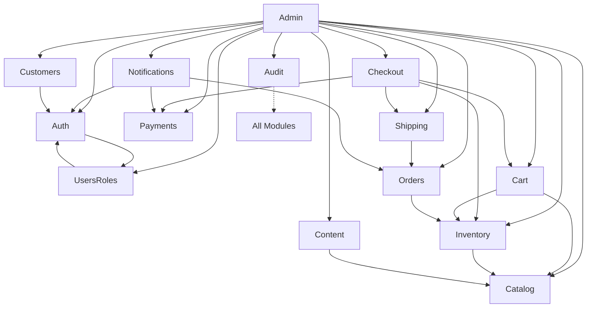

# Module Boundaries and Architecture

This document defines the structural boundaries and communication contracts for the Lungilicious modular monolith. It ensures that the 14 backend modules remain decoupled, maintainable, and testable. By following these rules, we prevent the codebase from turning into a tangled mess of dependencies.

## Module Dependency Graph

The following diagram shows how modules interact. We use event-driven patterns to break circular dependencies, especially in the checkout and payment flows.

## Module Ownership Table

Each Prisma model belongs to exactly one module. No module should ever write to a table owned by another module.

| Module | Prisma Models Owned |
| :--- | :--- |
| Auth | User, Session, PasswordReset, EmailVerification, MfaFactor |
| Users & Roles | Role, UserRole |
| Customers | Customer, CustomerAddress, CustomerPreference, CustomerPaymentMethod, CustomerSupportNote |
| Catalog | Product, ProductVariant, Category, ProductImage, ProductBadge, ProductSeo, ProductAttribute, DesignAsset, Price, Badge |
| Content | Page, PageSection, FaqItem, Testimonial, Gallery, GalleryItem |
| Inventory | Inventory, StockReservation |
| Cart | Cart, CartItem |
| Checkout | CheckoutSession |
| Orders | Order, OrderItem, OrderStatusHistory |
| Payments | PaymentIntent, PaymentTransaction, Refund, WebhookEvent, IdempotencyKey |
| Shipping | ShippingMethod, Shipment, ShipmentEvent |
| Notifications | None (Uses BullMQ queues) |
| Admin | None (Orchestrator) |
| Audit | AuditLog, JobRun, FeatureFlag |

## Boundary Rules and Decoupling

We use events to keep modules separate. This is vital for the core business flows.

1. **Checkout to Orders**: The Checkout module doesn't create orders. It emits an `OrderCreationRequested` event. The Orders module listens to this and handles the creation logic.
2. **Payments to Orders**: The Payments module never updates an order status. It emits a `PaymentSucceeded` or `PaymentFailed` event. The Orders module reacts to these events to move the order through its lifecycle.
3. **Inventory Reservations**: Checkout asks Inventory to reserve stock. If the checkout expires or fails, Checkout emits an event so Inventory can release the reservation.
4. **No Direct DB Access**: Modules must use the public API (services or controllers) of other modules. Direct database queries across boundaries are strictly forbidden.

## Detailed Module Definitions

### 1. Auth
The Auth module handles the identity and security of all users in the system. It manages the lifecycle of credentials and sessions.
*   **Purpose**: Registration, login, logout, password reset, email verification, MFA, and session management.
*   **Public API**: `AuthService.validateSession()`, `AuthService.generateToken()`, `AuthService.verifyMfa()`.
*   **Dependencies**: Users & Roles (for role assignment during registration).
*   **Forbidden Dependencies**: Orders, Payments, Catalog.
*   **Key Domain Entities**: User, Session, PasswordReset, EmailVerification, MfaFactor.
*   **Events Emitted**: `UserRegistered`, `PasswordChanged`, `MfaEnabled`.

### 2. Users & Roles
This module manages the authorization layer, defining what users can do within the application.
*   **Purpose**: User CRUD, roles, permissions, and role assignment.
*   **Public API**: `RolesService.hasPermission()`, `UsersService.getById()`.
*   **Dependencies**: Auth (for user identity links).
*   **Forbidden Dependencies**: Payments, Orders.
*   **Key Domain Entities**: Role, UserRole.
*   **Events Emitted**: `RoleAssigned`, `PermissionUpdated`.

### 3. Customers
Customers focuses on the buyer's profile and preferences, separate from their auth identity.
*   **Purpose**: Customer profiles, addresses, preferences, saved payment method metadata, and support notes.
*   **Public API**: `CustomerService.getProfile()`, `AddressService.validate()`.
*   **Dependencies**: Auth.
*   **Forbidden Dependencies**: Checkout, Payments (direct access).
*   **Key Domain Entities**: Customer, CustomerAddress, CustomerPreference, CustomerPaymentMethod, CustomerSupportNote.
*   **Events Emitted**: `ProfileUpdated`, `AddressAdded`.

### 4. Catalog
The Catalog is the source of truth for all sellable items and their presentation.
*   **Purpose**: Products, variants, categories, media, badges, SEO, editorial content, and design assets.
*   **Public API**: `ProductService.search()`, `CategoryService.getTree()`, `PriceService.getForVariant()`.
*   **Dependencies**: None. It's a root module.
*   **Forbidden Dependencies**: Orders, Cart (direct access).
*   **Key Domain Entities**: Product, ProductVariant, Category, ProductImage, ProductBadge, ProductSeo, ProductAttribute, DesignAsset, Price, Badge.
*   **Events Emitted**: `ProductPriceChanged`, `CategoryDeleted`.

### 5. Content
Content manages the marketing and informational pages of the site.
*   **Purpose**: Pages, hero blocks, sections, FAQ, testimonials, campaigns, and galleries.
*   **Public API**: `PageService.getBySlug()`, `CampaignService.getActive()`.
*   **Dependencies**: Catalog (for product references in sections).
*   **Forbidden Dependencies**: Auth, Payments.
*   **Key Domain Entities**: Page, PageSection, FaqItem, Testimonial, Gallery, GalleryItem.
*   **Events Emitted**: `PagePublished`.

### 6. Inventory
Inventory tracks the physical availability of products and manages temporary holds.
*   **Purpose**: Stock levels, reservations, low stock thresholds, and adjustments.
*   **Public API**: `InventoryService.checkStock()`, `ReservationService.reserve()`.
*   **Dependencies**: Catalog (for variant references).
*   **Forbidden Dependencies**: Payments, Auth.
*   **Key Domain Entities**: Inventory, StockReservation.
*   **Events Emitted**: `StockLevelLow`, `ReservationExpired`.

### 7. Cart
The Cart module handles the temporary collection of items a user intends to buy.
*   **Purpose**: Guest and authenticated carts, line items, and cart merging on login.
*   **Public API**: `CartService.get()`, `CartService.addItem()`.
*   **Dependencies**: Catalog (variant lookup), Inventory (stock check).
*   **Forbidden Dependencies**: Payments (direct access).
*   **Key Domain Entities**: Cart, CartItem.
*   **Events Emitted**: `CartMerged`, `ItemAddedToCart`.

### 8. Checkout
Checkout orchestrates the transition from a cart to a potential order.
*   **Purpose**: Checkout session lifecycle, address capture, shipping selection, payment intent, and stock revalidation.
*   **Public API**: `CheckoutService.start()`, `CheckoutService.complete()`.
*   **Dependencies**: Cart, Inventory (reservations), Payments (intent creation), Shipping.
*   **Forbidden Dependencies**: Orders. It must emit an event instead of writing to the orders table.
*   **Key Domain Entities**: CheckoutSession.
*   **Events Emitted**: `OrderCreationRequested`, `CheckoutStarted`.

### 9. Orders
Orders manages the permanent record of a purchase and its fulfillment status.
*   **Purpose**: Order creation, line item snapshots, status transitions, and history.
*   **Public API**: `OrderService.getHistory()`, `OrderService.updateStatus()`.
*   **Dependencies**: Checkout (receives event), Inventory (stock confirmation).
*   **Forbidden Dependencies**: Cart (direct access), Payments (direct access).
*   **Key Domain Entities**: Order, OrderItem, OrderStatusHistory.
*   **Events Emitted**: `OrderPlaced`, `OrderStatusChanged`.

### 10. Payments
This module abstracts the complexities of payment providers and handles financial transactions.
*   **Purpose**: Provider abstraction, payment intents, webhooks, refunds, and idempotency.
*   **Public API**: `PaymentService.createIntent()`, `RefundService.process()`.
*   **Dependencies**: None. It uses a provider-agnostic interface.
*   **Forbidden Dependencies**: Orders (direct access). It emits events only.
*   **Key Domain Entities**: PaymentIntent, PaymentTransaction, Refund, WebhookEvent, IdempotencyKey.
*   **Events Emitted**: `PaymentSucceeded`, `PaymentFailed`, `RefundProcessed`.

### 11. Shipping/Fulfillment
Shipping handles the logistics of getting products to the customer.
*   **Purpose**: Shipping methods, delivery zones, and shipment tracking.
*   **Public API**: `ShippingService.getRates()`, `TrackingService.update()`.
*   **Dependencies**: Orders (for order references).
*   **Forbidden Dependencies**: Payments, Auth.
*   **Key Domain Entities**: ShippingMethod, Shipment, ShipmentEvent.
*   **Events Emitted**: `ShipmentDispatched`, `DeliveryConfirmed`.

### 12. Notifications
Notifications is a utility module that communicates with users through various channels.
*   **Purpose**: Email, SMS, and push notifications. All work is done asynchronously via BullMQ.
*   **Public API**: `NotificationService.send()`.
*   **Dependencies**: Auth (welcome emails), Orders (confirmation), Payments (receipts).
*   **Forbidden Dependencies**: Writing to any other module's database tables.
*   **Key Domain Entities**: None. It uses queue jobs.
*   **Events Emitted**: `NotificationSent`.

### 13. Admin
The Admin module is the control center for staff to manage the entire platform.
*   **Purpose**: Product CRUD, media management, inventory adjustments, order inspection, refund actions, content editing, and audit views.
*   **Public API**: None. It's an orchestrator.
*   **Dependencies**: All other modules. It performs read and admin write operations across the system.
*   **Forbidden Dependencies**: Bypassing RBAC guards.
*   **Key Domain Entities**: None.
*   **Events Emitted**: `AdminActionTaken`.

### 14. Audit
Audit provides a secure, append-only record of system activity and configuration.
*   **Purpose**: Audit log writes, job tracking, and feature flags.
*   **Public API**: `AuditService.log()`, `FeatureFlagService.isEnabled()`.
*   **Dependencies**: None. It's a write-only global module.
*   **Forbidden Dependencies**: Reading from other modules, updating or deleting audit logs.
*   **Key Domain Entities**: AuditLog, JobRun, FeatureFlag.
*   **Events Emitted**: None.

## Circular Dependency Prevention

To keep the system healthy, we avoid circular dependencies at the code level. If Module A depends on Module B, Module B cannot depend on Module A. 

We solve the Checkout, Orders, and Payments triangle through event-driven decoupling. Checkout requests an order, but doesn't wait for it. Orders waits for a payment success event before moving to a "Paid" state. Payments doesn't know about orders, it only knows about transactions and intents. This flow ensures that each module can change its internal logic without forcing a cascade of changes across the entire system.
