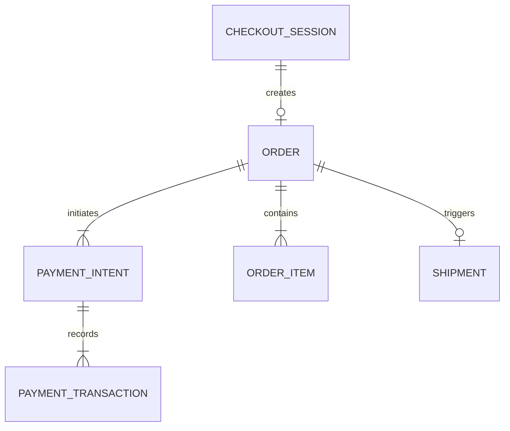

# Lungilicious Database Schema v1

This document outlines the PostgreSQL database structure for the Lungilicious platform. It serves as the primary reference for the Prisma schema implementation.

## Design Decisions

*   **Primary Keys**: All tables use UUID v4 generated via `gen_random_uuid()`.
*   **Soft Deletes**: The `deletedAt` timestamp tracks logical deletion for users, customers, and products.
*   **Timestamps**: Every table includes `createdAt`. Tables that allow updates include `updatedAt`.
*   **Currency and Money**: Financial values use `DECIMAL(12,2)` to ensure precision. Floating point types are avoided.
*   **Naming Convention**: Tables use `snake_case` names, mapped from PascalCase Prisma models.
*   **Schema Organization**: The Prisma schema is split into domain specific files within `prisma/schema/`.
*   **Encryption**: Sensitive data like phone numbers, addresses, and support notes will be encrypted at the application level in future phases.

## Entity Relationship Diagram: Checkout Flow

## Domain: Identity

### users
Stores core authentication and account data.
*   `id`: UUID PK
*   `email`: TEXT (Unique)
*   `passwordHash`: TEXT
*   `emailVerifiedAt`: TIMESTAMP
*   `createdAt`: TIMESTAMP
*   `updatedAt`: TIMESTAMP
*   `deletedAt`: TIMESTAMP (Soft delete)
*   **Indexes**: Unique index on `email`.

### roles
Defines system access levels.
*   `id`: UUID PK
*   `name`: ENUM (ADMIN, CUSTOMER, STAFF)
*   `createdAt`: TIMESTAMP

### user_roles
Maps users to their respective roles.
*   `userId`: UUID FK (users)
*   `roleId`: UUID FK (roles)
*   `assignedAt`: TIMESTAMP
*   `assignedBy`: UUID FK (users)
*   **PK**: Composite (userId, roleId).

### sessions
Tracks active user authentication sessions.
*   `id`: UUID PK
*   `userId`: UUID FK (users)
*   `data`: JSONB
*   `expiresAt`: TIMESTAMP
*   `createdAt`: TIMESTAMP
*   `ipAddress`: INET
*   `userAgent`: TEXT
*   `revokedAt`: TIMESTAMP

### password_resets
Manages password recovery tokens.
*   `id`: UUID PK
*   `userId`: UUID FK (users)
*   `tokenHash`: TEXT (Unique)
*   `expiresAt`: TIMESTAMP
*   `usedAt`: TIMESTAMP
*   `createdAt`: TIMESTAMP

### email_verifications
Handles email ownership confirmation.
*   `id`: UUID PK
*   `userId`: UUID FK (users)
*   `tokenHash`: TEXT (Unique)
*   `expiresAt`: TIMESTAMP
*   `usedAt`: TIMESTAMP
*   `createdAt`: TIMESTAMP

### mfa_factors
Stores multi factor authentication settings.
*   `id`: UUID PK
*   `userId`: UUID FK (users)
*   `type`: ENUM (TOTP, SMS)
*   `secret`: TEXT (Encrypted)
*   `verifiedAt`: TIMESTAMP
*   `createdAt`: TIMESTAMP

## Domain: Customer

### customers
Extends user data with profile information.
*   `id`: UUID PK
*   `userId`: UUID FK (users, Unique)
*   `firstName`: TEXT
*   `lastName`: TEXT
*   `phone`: TEXT
*   `avatarUrl`: TEXT
*   `marketingConsent`: BOOLEAN
*   `communicationConsent`: BOOLEAN
*   `notes`: TEXT
*   `createdAt`: TIMESTAMP
*   `updatedAt`: TIMESTAMP
*   `deletedAt`: TIMESTAMP

### customer_addresses
Stores shipping and billing locations.
*   `id`: UUID PK
*   `customerId`: UUID FK (customers)
*   `label`: TEXT (e.g., Home, Office)
*   `firstName`: TEXT
*   `lastName`: TEXT
*   `line1`: TEXT
*   `line2`: TEXT
*   `city`: TEXT
*   `province`: TEXT
*   `postalCode`: TEXT
*   `country`: TEXT (Default: 'ZA')
*   `isDefault`: BOOLEAN
*   `createdAt`: TIMESTAMP
*   `updatedAt`: TIMESTAMP

### customer_preferences
Tracks user specific settings and dietary needs.
*   `id`: UUID PK
*   `customerId`: UUID FK (customers, Unique)
*   `currency`: TEXT (Default: 'ZAR')
*   `language`: TEXT (Default: 'en')
*   `dietaryFlags`: TEXT[]
*   `createdAt`: TIMESTAMP
*   `updatedAt`: TIMESTAMP

### customer_payment_methods
Saved payment details for faster checkout.
*   `id`: UUID PK
*   `customerId`: UUID FK (customers)
*   `provider`: ENUM (PAYSTACK, STRIPE)
*   `providerToken`: TEXT (Not a card number)
*   `brand`: TEXT
*   `last4`: TEXT
*   `expiryMonth`: INT
*   `expiryYear`: INT
*   `isDefault`: BOOLEAN
*   `createdAt`: TIMESTAMP
*   `revokedAt`: TIMESTAMP

### customer_support_notes
Internal staff notes regarding customer interactions.
*   `id`: UUID PK
*   `customerId`: UUID FK (customers)
*   `content`: TEXT
*   `createdBy`: UUID FK (users)
*   `createdAt`: TIMESTAMP (Append only)

## Domain: Catalog

### categories
Product groupings for navigation.
*   `id`: UUID PK
*   `name`: TEXT
*   `slug`: TEXT (Unique)
*   `description`: TEXT
*   `parentId`: UUID FK (categories)
*   `createdAt`: TIMESTAMP
*   `updatedAt`: TIMESTAMP

### products
Core product definitions with editorial content.
*   `id`: UUID PK
*   `slug`: TEXT (Unique)
*   `name`: TEXT
*   `headline`: TEXT
*   `storyIntro`: TEXT
*   `ingredientNarrative`: TEXT
*   `wellnessPositioning`: TEXT
*   `layoutVariant`: ENUM (STANDARD, FEATURE, MINIMAL)
*   `themeAccent`: ENUM (EARTH, WATER, FIRE, AIR)
*   `emphasisStyle`: ENUM (BOLD, SOFT, MODERN)
*   `createdAt`: TIMESTAMP
*   `updatedAt`: TIMESTAMP
*   `deletedAt`: TIMESTAMP

### product_variants
Specific sellable units (SKUs).
*   `id`: UUID PK
*   `productId`: UUID FK (products)
*   `sku`: TEXT (Unique)
*   `name`: TEXT
*   `price`: DECIMAL(12,2)
*   `createdAt`: TIMESTAMP
*   `updatedAt`: TIMESTAMP

### product_images
Visual assets for products.
*   `id`: UUID PK
*   `productId`: UUID FK (products)
*   `url`: TEXT
*   `altText`: TEXT
*   `isPrimary`: BOOLEAN
*   `sortOrder`: INT

### product_badges
Visual labels like "New" or "Organic".
*   `id`: UUID PK
*   `productId`: UUID FK (products)
*   `badgeType`: ENUM (NEW, BESTSELLER, ORGANIC, VEGAN)
*   `createdAt`: TIMESTAMP

### product_seo
Search engine optimization metadata.
*   `id`: UUID PK
*   `productId`: UUID FK (products, Unique)
*   `title`: TEXT
*   `description`: TEXT
*   `keywords`: TEXT[]

### product_attributes
Key value pairs for technical specs.
*   `id`: UUID PK
*   `productId`: UUID FK (products)
*   `key`: TEXT
*   `value`: TEXT

### design_assets
Reusable UI elements for product pages.
*   `id`: UUID PK
*   `name`: TEXT
*   `url`: TEXT
*   `type`: TEXT

## Domain: Pricing/Promotions

### prices
Historical and scheduled pricing.
*   `id`: UUID PK
*   `productVariantId`: UUID FK (product_variants)
*   `amount`: DECIMAL(12,2)
*   `currency`: TEXT
*   `validFrom`: TIMESTAMP
*   `validUntil`: TIMESTAMP
*   `isActive`: BOOLEAN

### promotions
Discount rules and campaigns.
*   `id`: UUID PK
*   `name`: TEXT
*   `type`: ENUM (PERCENTAGE, FIXED_AMOUNT, FREE_SHIPPING)
*   `discountValue`: DECIMAL(12,2)
*   `minOrderAmount`: DECIMAL(12,2)
*   `maxUsageCount`: INT
*   `validFrom`: TIMESTAMP
*   `validUntil`: TIMESTAMP

### coupon_codes
Unique strings for applying promotions.
*   `id`: UUID PK
*   `promotionId`: UUID FK (promotions)
*   `code`: TEXT (Unique)
*   `maxUsageCount`: INT
*   `usedCount`: INT

### coupon_redemptions
Records of coupon usage.
*   `id`: UUID PK
*   `couponCodeId`: UUID FK (coupon_codes)
*   `orderId`: UUID FK (orders)
*   `customerId`: UUID FK (customers)
*   `discountAmount`: DECIMAL(12,2)
*   `redeemedAt`: TIMESTAMP

## Domain: Commerce - Cart/Checkout

### carts
Temporary storage for shopping items.
*   `id`: UUID PK
*   `customerId`: UUID FK (customers, Nullable)
*   `sessionId`: TEXT (Nullable)
*   `status`: ENUM (ACTIVE, ABANDONED, CONVERTED)
*   `expiresAt`: TIMESTAMP

### cart_items
Individual products within a cart.
*   `id`: UUID PK
*   `cartId`: UUID FK (carts)
*   `productVariantId`: UUID FK (product_variants)
*   `quantity`: INT
*   `priceAtAdd`: DECIMAL(12,2)

### checkout_sessions
State management for the checkout process.
*   `id`: UUID PK
*   `cartId`: UUID FK (carts)
*   `customerId`: UUID FK (customers, Nullable)
*   `addressId`: UUID FK (customer_addresses, Nullable)
*   `shippingMethodId`: UUID FK (shipping_methods, Nullable)
*   `status`: ENUM (OPEN, COMPLETED, EXPIRED)
*   `expiresAt`: TIMESTAMP

### stock_reservations
Prevents overselling during checkout.
*   `id`: UUID PK
*   `productVariantId`: UUID FK (product_variants)
*   `quantity`: INT
*   `orderId`: UUID FK (orders, Nullable)
*   `checkoutSessionId`: UUID FK (checkout_sessions, Nullable)
*   `status`: ENUM (PENDING, CONFIRMED, RELEASED, EXPIRED)
*   `expiresAt`: TIMESTAMP

### inventory
Current stock levels.
*   `id`: UUID PK
*   `productVariantId`: UUID FK (product_variants, Unique)
*   `availableQuantity`: INT
*   `reservedQuantity`: INT
*   `soldQuantity`: INT
*   `lowStockThreshold`: INT (Default: 5)

## Domain: Commerce - Orders/Shipping

### orders
Finalized customer purchases.
*   `id`: UUID PK
*   `orderNumber`: TEXT (Unique)
*   `customerId`: UUID FK (customers)
*   `status`: ENUM (DRAFT, PENDING_PAYMENT, PAYMENT_PROCESSING, PAID, AWAITING_FULFILLMENT, FULFILLED, CANCELLED, PARTIALLY_REFUNDED, REFUNDED, PAYMENT_FAILED)
*   `subtotal`: DECIMAL(12,2)
*   `shippingFee`: DECIMAL(12,2)
*   `taxAmount`: DECIMAL(12,2)
*   `totalAmount`: DECIMAL(12,2)
*   `currency`: TEXT (Default: 'ZAR')
*   `createdAt`: TIMESTAMP
*   `updatedAt`: TIMESTAMP

### order_items
Snapshot of products at the time of purchase.
*   `id`: UUID PK
*   `orderId`: UUID FK (orders)
*   `productVariantId`: UUID FK (product_variants)
*   `productSnapshotName`: TEXT
*   `sku`: TEXT
*   `quantity`: INT
*   `unitPrice`: DECIMAL(12,2)
*   `lineTotal`: DECIMAL(12,2)

### order_status_history
Audit trail for order state changes.
*   `id`: UUID PK
*   `orderId`: UUID FK (orders)
*   `fromStatus`: TEXT
*   `toStatus`: TEXT
*   `changedBy`: UUID FK (users)
*   `reason`: TEXT
*   `createdAt`: TIMESTAMP

### shipping_methods
Available delivery options.
*   `id`: UUID PK
*   `name`: TEXT
*   `price`: DECIMAL(12,2)
*   `estimatedDays`: INT
*   `isActive`: BOOLEAN

### shipments
Tracking information for physical delivery.
*   `id`: UUID PK
*   `orderId`: UUID FK (orders)
*   `trackingCode`: TEXT
*   `carrier`: TEXT
*   `status`: ENUM (PENDING, SHIPPED, IN_TRANSIT, DELIVERED, RETURNED)
*   `shippedAt`: TIMESTAMP
*   `deliveredAt`: TIMESTAMP

### shipment_events
Detailed logs from the carrier.
*   `id`: UUID PK
*   `shipmentId`: UUID FK (shipments)
*   `status`: TEXT
*   `description`: TEXT
*   `occurredAt`: TIMESTAMP

## Domain: Payments

### payment_intents
Intent to charge a customer.
*   `id`: UUID PK
*   `orderId`: UUID FK (orders)
*   `provider`: TEXT
*   `providerSessionId`: TEXT
*   `providerTransactionId`: TEXT
*   `amount`: DECIMAL(12,2)
*   `currency`: TEXT
*   `status`: TEXT
*   `metadata`: JSONB

### payment_transactions
Individual financial movements.
*   `id`: UUID PK
*   `paymentIntentId`: UUID FK (payment_intents)
*   `type`: ENUM (CAPTURE, REFUND, VOID)
*   `amount`: DECIMAL(12,2)
*   `providerTransactionId`: TEXT (Unique)
*   `status`: TEXT
*   `metadata`: JSONB

### refunds
Reversals of payments.
*   `id`: UUID PK
*   `orderId`: UUID FK (orders)
*   `paymentIntentId`: UUID FK (payment_intents)
*   `providerRefundId`: TEXT
*   `amount`: DECIMAL(12,2)
*   `type`: ENUM (FULL, PARTIAL)
*   `status`: ENUM (PENDING, COMPLETED, FAILED)
*   `reason`: TEXT
*   `requestedBy`: UUID FK (users)
*   `idempotencyKey`: TEXT (Unique)

### webhook_events
Logs of incoming provider notifications.
*   `id`: UUID PK
*   `provider`: TEXT
*   `providerEventId`: TEXT (Unique)
*   `eventType`: TEXT
*   `payload`: JSONB
*   `rawPayload`: TEXT
*   `status`: ENUM (RECEIVED, PROCESSED, FAILED)
*   `errorMessage`: TEXT
*   `processedAt`: TIMESTAMP

### idempotency_keys
Ensures requests are only processed once.
*   `id`: UUID PK
*   `key`: TEXT (Unique)
*   `requestHash`: TEXT
*   `responseStatus`: INT
*   `responseBody`: TEXT
*   `expiresAt`: TIMESTAMP

## Domain: Content

### pages
Static or dynamic web pages.
*   `id`: UUID PK
*   `slug`: TEXT (Unique)
*   `title`: TEXT
*   `seoTitle`: TEXT
*   `seoDescription`: TEXT
*   `status`: ENUM (DRAFT, PUBLISHED, ARCHIVED)
*   `heroSectionId`: UUID FK (page_sections, Nullable)

### page_sections
Modular components within a page.
*   `id`: UUID PK
*   `pageId`: UUID FK (pages)
*   `type`: ENUM (HERO, TEXT, IMAGE_GRID, FAQ, TESTIMONIALS)
*   `order`: INT
*   `data`: JSONB

### faq_items
Frequently asked questions.
*   `id`: UUID PK
*   `question`: TEXT
*   `answer`: TEXT
*   `category`: TEXT
*   `sortOrder`: INT
*   `isActive`: BOOLEAN

### testimonials
Customer reviews and social proof.
*   `id`: UUID PK
*   `authorName`: TEXT
*   `authorTitle`: TEXT
*   `content`: TEXT
*   `rating`: INT (1-5)
*   `isActive`: BOOLEAN
*   `sortOrder`: INT

### galleries
Collections of visual media.
*   `id`: UUID PK
*   `name`: TEXT
*   `description`: TEXT

### gallery_items
Individual media files in a gallery.
*   `id`: UUID PK
*   `galleryId`: UUID FK (galleries)
*   `url`: TEXT
*   `altText`: TEXT
*   `caption`: TEXT
*   `photographer`: TEXT
*   `sortOrder`: INT

## Domain: Platform

### audit_logs
Immutable record of system actions.
*   `id`: UUID PK
*   `userId`: UUID FK (users, Nullable)
*   `action`: TEXT
*   `resource`: TEXT
*   `resourceId`: TEXT
*   `before`: JSONB
*   `after`: JSONB
*   `ipAddress`: INET
*   `userAgent`: TEXT
*   `createdAt`: TIMESTAMP (Append only)

### feature_flags
Toggleable application features.
*   `id`: UUID PK
*   `name`: TEXT (Unique)
*   `description`: TEXT
*   `isEnabled`: BOOLEAN
*   `rolloutPercentage`: INT (0-100)

### job_runs
Tracking for background tasks.
*   `id`: UUID PK
*   `queue`: TEXT
*   `jobId`: TEXT
*   `jobName`: TEXT
*   `status`: ENUM (PENDING, RUNNING, COMPLETED, FAILED)
*   `startedAt`: TIMESTAMP
*   `completedAt`: TIMESTAMP
*   `error`: TEXT
*   `metadata`: JSONB
